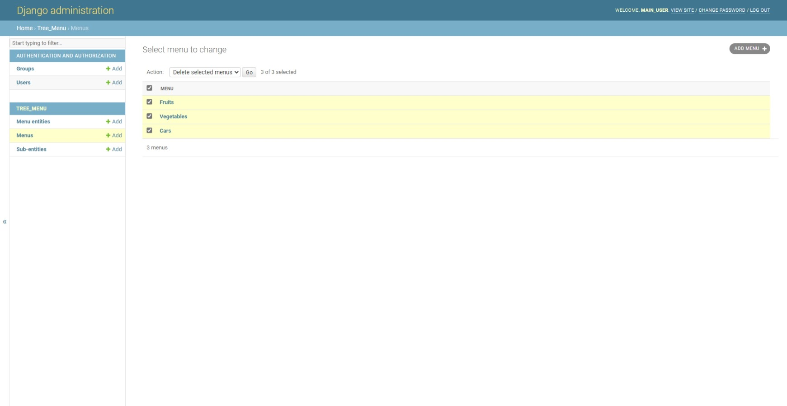
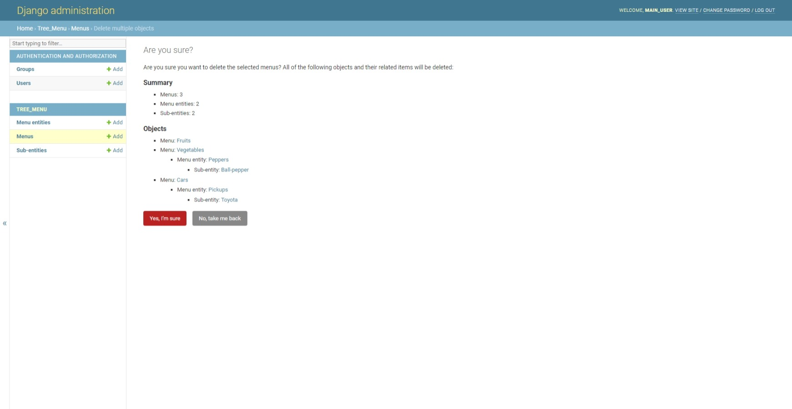
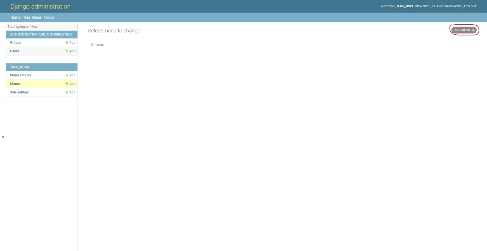
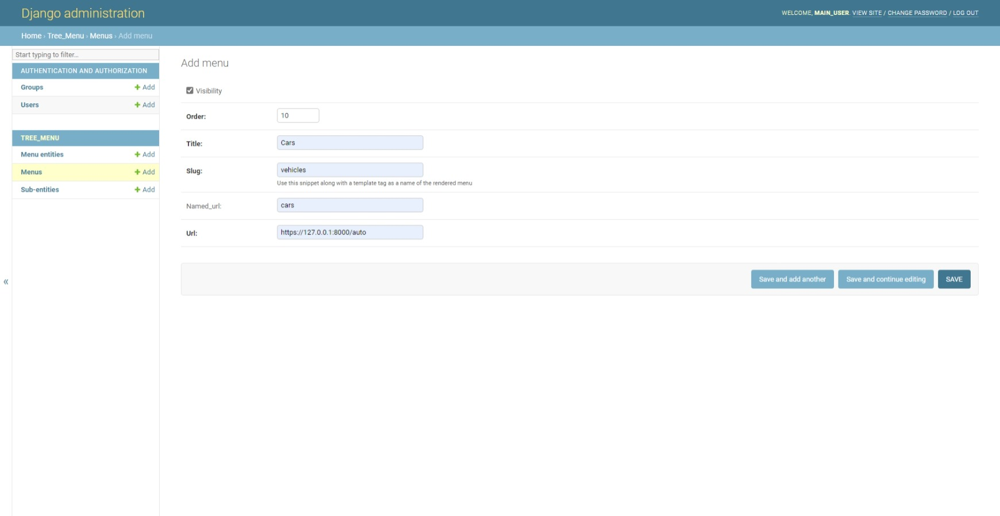
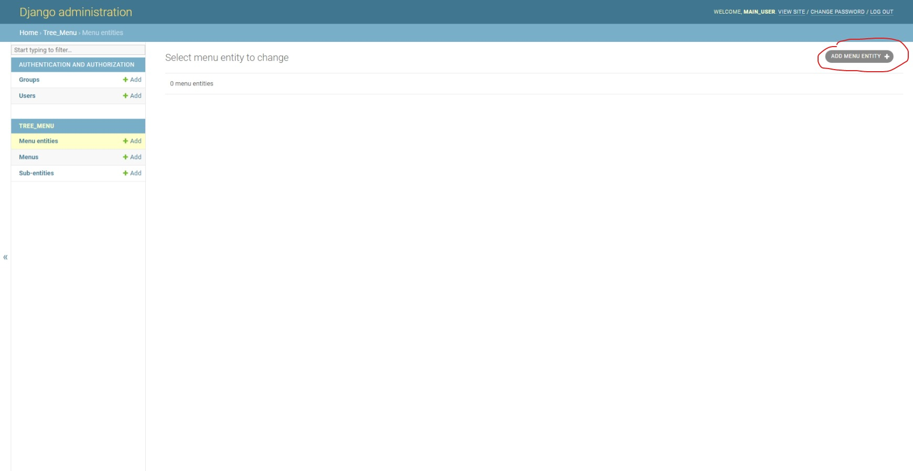
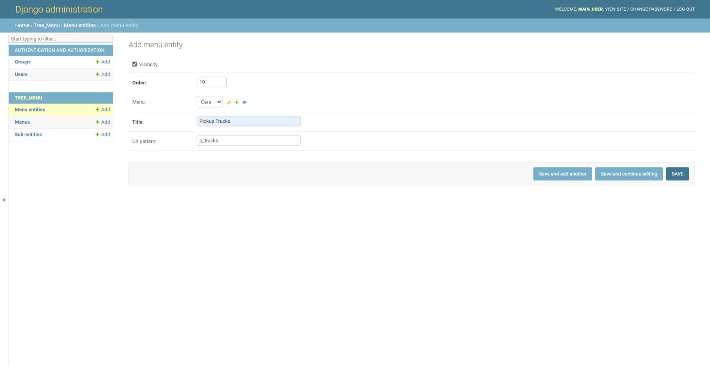
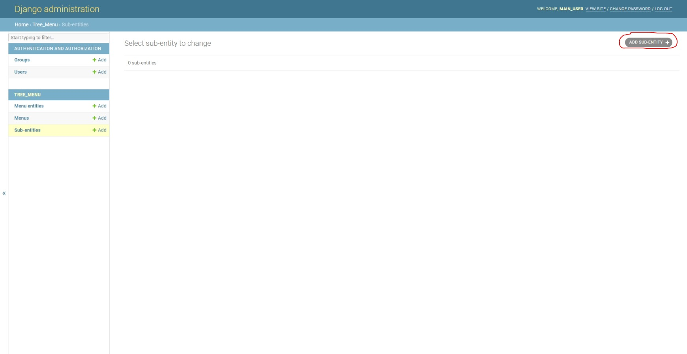
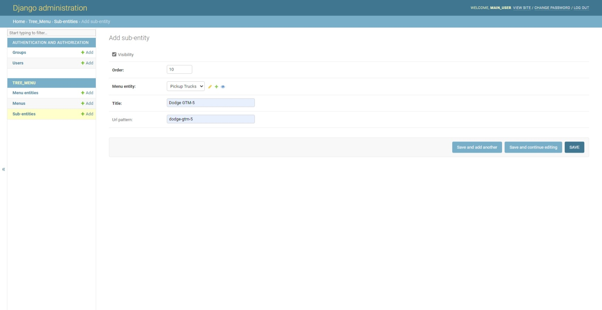

# django_menu

In sake of brevity, this django app allows you to create a menu in a particular HTML template.
The menu is created with a unique name based on the 'slug' value specified when defining a new **Menu** model on the Django-admin toolpage.
There are several expanded layers in the tree menu. The *first layer* is a block of the parental menus, ones that are added via the 'slugs'. 
The *second one* contains all the menu entities each **menu** may contain. The *last layer* comprises of sub-entities each **menu entity** contains.
An entire menu system is stored in the DataBase. All the levels of menu are either modified or deleted via the Django-admin toolpage.

# Setting up
1) First of all, establish your virtual environment and manage to install all the required stuff mentioned in the **requirements.txt**;
```
pip install -r requirements.txt
```

2) After having cloned this repository, create a blank pythonic file and name it, say, **secrs.py** where you should store your Django SECRET KEY, your admin-password and username;

3) In settings.py, if you are up to, besides your SECRET KEY, you can retrieve all the private data and locate it in the **secrs.py**, so you can further import this file to **settings.py** and substantiate all the retrived data by just the imported variables. Note that the file with your credentials should be located in the *same* directory as the **settings.py** file is. Otherwise, you will have to change a system path in a working program. You can generate a secret key and assign it to SECRET KEY, it should work;

4) Assuming you've got the latest version of Django and everything based on the requirements.txt is ready to use, issue the command below in order to get your DataBase done;
```
python manage.py makemigrations tree_menu
```
and then:
```
python manage.py migrate
```
5) Launch your local server to make sure whether it is working properly. If everything flows well and your local server has gotten all right, set up a superuser account:
```
python manage.py createsuperuser
```
6) Run the server and go to the admin page. Here you can see the menus already exist. This is how it looks like when you've created more than one menu;



7) When you delete a menu, all the children and sub-children belonging will be deleted as well. This is how a menu system looks like;


8) So, lets create a menu "Cars";


9) As mentioned before, there is a 'slug' name that represents a word in the HTML template you want to draw menu to ``````. Currently, the slug name is *vehicles*;


10) Then we would like to create a menu entity that is gonna represent a subcategory of the main menu; lets call it "Pickup Trucks", one of the car types;


11) When defining a menu entity, a url of both child and subchild of the menu is generated automatically in thanks to the **named_url** fields that are appended to the main url with each deeper level;


12) Here we also may want to add a particular Car-Pickup Truck vendor, say, "Dodge GTM-5"; this sub-menu entity is gonna be the third layer of the menu;


13) Here are the fields of the **Sub-Menu Entity** model;


14) And, eventually, go to the */auto* page. You'll see the menu **Cars** with hoverable sheets: **Pickup Trucks** and **Toyota GMT-5**;

15) You can also create another menu: if you are going to add one to the same page, do the same as above and set the **same** slug to the **Menu** model. But if you feel like to create another menu on other pages, just specify one of the **slugs** that already exist in the HTML templates, for example `````` which will invoke the index page and all the menus assosiated by the slug *"index"*;

16) Here we are :-).
