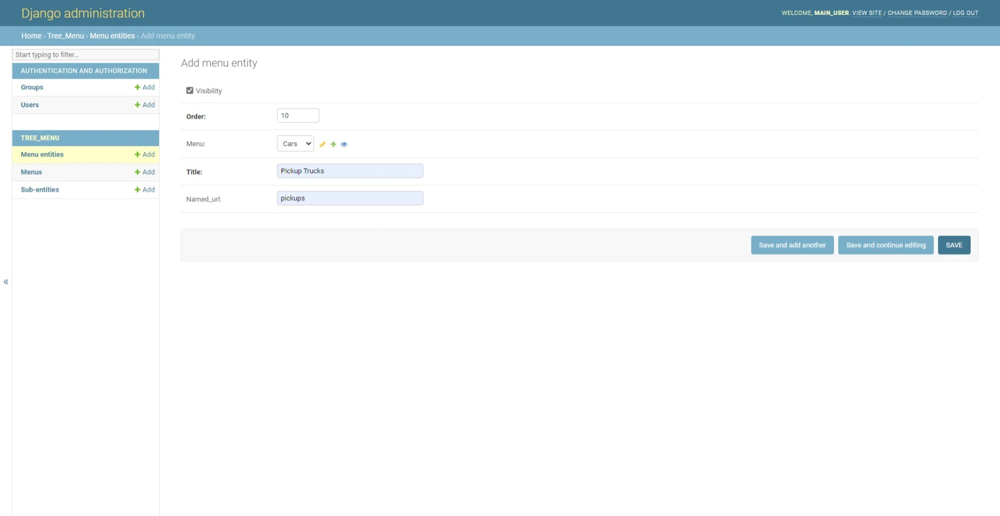

# django_menu

In sake of brevity, this django app allows you to create a menu in a particular HTML template.
The menu is created with a unique name based on the 'slug' value specified when defining a new **Menu** model on the Django-admin toolpage.
There are several expanded layers in the tree menu. The *first layer* is a block of the parental menus, ones that are added via the 'slugs'. 
The *second one* contains all the menu entities each **menu** may contain. The *last layer* comprises of sub-entities each **menu entity** contains.
An entire menu system is stored in the DataBase. All the levels of menu are either modified or deleted via the Django-admin toolpage.

# Setting up
1) Assuming you've got the latest version of Django and everything based on the requirements.txt is ready to use, set up a superuser account:
```
python manage.py createsuperuser
```
2) Then create a blank pythonic file and name it, say, **secrs.py** where you should store your Django SECRET KEY, your admin-password and username;
3) In settings.py, if you are up to, besides your SECRET KEY, you can retrive all the private data and locate it in the **secrs.py**. So you can further import this file to **settings.py** and substantiate all the retrived data by just the imported variables. Note that the file with your credentials should be located in the *same* directory as the **settings.py** file is. Otherwise, you will have to change a system path in working program;
4) Run the server and go to the admin page. Here you can see the menus already exist. This is how it looks like when you've created more than one menu;

5) When you delete a menu, all the children and sub-children belonging will be deleted as well. This is how a menu system looks like;

6) So, lets create a menu "Cars";

7) As mentioned before, there is a 'slug' name that represents a word in the HTML template you want to draw menu to;

8) Then we would like to create a menu entity that is gonna represent a subcategory of the main menu; lets call it "Pickup Trucks", one of the car types;

9) When defining a menu entity, a url of both child an subchild of the menu is generated automatically in thanks to the named url fields that are appended to the main url with each deeper level;

10) Here we also may want to add a particular Car-Pickup Truck vendor, say "Toyota GMT-5"; this sub-menu entity is gonna be the third layer of the menu;

11) Here are the fields of the **Sub-Menu Entity** model;

